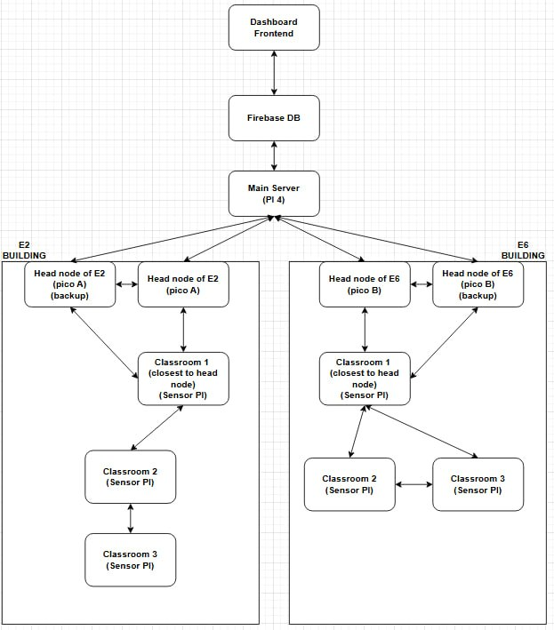
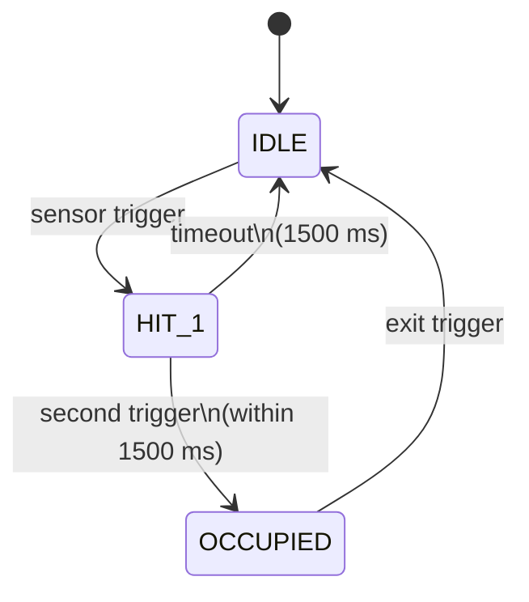

# Section III: Design (Word Limit: 750 words)

## Architecture

The system employs a hierarchical, multi-tier IoT architecture for reliable classroom monitoring. At the edge, Raspberry Pi Pico W [10] devices with PIR and ultrasonic sensors detect occupancy in individual classrooms. Within each building, sensor nodes form a local BLE mesh topology, routing data through intermediate nodes toward building-designated head nodes. These head nodes, configured with active-passive redundant backups, aggregate local data and forward it to a central Main Server on a Raspberry Pi 4 [9]. The Main Server acts as an MQTT [1] broker and bridge, collecting telemetry from the Pico W network and pushing it to Firebase Firestore [7] over HTTPS for real-time dashboard updates.

*Figure 1: End-to-end data flow. Dashed line shows LWT-triggered active-passive failover.*

## Technology Selection

MQTT was selected over alternatives such as HTTP or CoAP based on project requirements and literature evidence. Studies on indoor occupancy monitoring [5][6] highlight the need for low-overhead, scalable messaging in sensor networks. MQTT's publish/subscribe model decouples nodes from the server, its minimal packet overhead suits memory-constrained Pico W devices, and QoS 1 delivery guarantees prevent data loss over unreliable WiFi links. Critically, MQTT's native Last Will and Testament (LWT) mechanism directly enables the active-passive failover design: backup head nodes activate automatically when the primary's LWT fires. Retained messages ensure newly connected clients immediately receive current node states. Eclipse Mosquitto [8] served as the reference model for the custom broker implementation. Bluetooth Low Energy (BLE) was selected for the intra-building mesh due to its native support on the Pico W's CYW43439 chipset, sub-milliwatt advertising power, and mesh-capable range for classroom-to-corridor hops without additional infrastructure [4][14].

## Data Collection and Processing

Sensor data is stored in Firebase Firestore [7], a NoSQL document database whose hierarchical structure maps directly to the "Building → Classroom → Sensor" layout. When messages arrive at the broker, the Python bridge on the Raspberry Pi 4 [9] decrypts and parses them, then upserts records in Firestore. Processing occurs in two stages: edge filtering (sensor debouncing on the Pico W before transmission) and cloud analytics (moving-average occupancy rates, peak usage hours, per-classroom heatmaps, and redundant head node health checks).

## User Interaction and Possible Future Integrations

Users interact via a centralized web dashboard that pulls real-time data from the Firestore REST API and displays occupancy status and usage trends. Since Firestore is cloud-hosted, students can access it from any authorized device. The architecture supports future integrations: Firebase Cloud Functions [11] or webhooks can link the system to campus scheduling platforms, and the MQTT interface opens paths to broader IoT ecosystems such as AWS IoT [3][12], positioning the design as a replicable blueprint for multi-protocol smart-campus deployments.

## Security Protocols

Five layered security measures protect data integrity and confidentiality. First, MQTT Authentication: all clients authenticate with a username and password; invalid or missing credentials result in a CONNACK return code 5 (Not Authorized), with credentials scoped per building cluster to limit exposure from any single compromise. Second, a Client ID Allowlist: the broker enforces pattern matching, accepting only IDs conforming to Pi4-HeadNode-E\<N>, Pi4-BackUp-E\<N>, or bridge, preventing rogue devices regardless of password. Third, Topic-Level ACL: primary head nodes may only publish within their own namespace; backup nodes additionally publish under the primary's namespace for failover continuity; the bridge is restricted to subscribe-only access.

| Client | Publish | Subscribe |
| --- | --- | --- |
| `Pi4-HeadNode-E<N>` | `building/E<N>/primary/#` | — |
| `Pi4-BackUp-E<N>` | `building/E<N>/primary/#`, `building/E<N>/backup/#` | — |
| `bridge` | — | `building/#` |

*Table 1: MQTT topic-level ACL — each client is restricted to its minimum required namespace.* Fourth, AES-128-CBC [13] Payload Encryption: each message prepends a fresh 16-byte random IV to the ciphertext; the Firebase [2] bridge extracts the IV, decrypts the payload, and parses the resulting JSON before writing to Firestore. Status messages are intentionally transmitted in plaintext, as broker coordinator logic must read them to manage cluster health. Fifth, Firestore Security Rules: dashboard clients may read freely but write only the maxOccupancy field; all other writes are blocked at the database layer, with the bridge's service account retaining full write access as the sole authorised ingestion path.

## Challenges and Solutions

Three implementation challenges were addressed during development. Sensor noise was the primary edge issue: PIR and ultrasonic sensors produced frequent false triggers in busy corridors, resolved by implementing a finite-state machine with a two-consecutive-hit confirmation threshold and a 1,500 ms timeout that resets incomplete entry/exit sequences.

*Figure 2: Sensor FSM — two consecutive hits required to confirm occupancy; a single trigger that times out resets to IDLE.* In the BLE mesh, multi-hop relay caused duplicate frame delivery, as the same advertisement could arrive from multiple intermediate nodes; a 200-entry rolling deduplication window keyed on (UID, message ID) pairs prevents double-counting. Finally, network instability on constrained hardware required robust reconnection logic: the bridge retries with a 10-second backoff after MQTT disconnections, root nodes re-establish connections within five seconds of a publish failure, and both sides send periodic keep-alive pings to detect silent drops early.

## References

[1] A. Banks and R. Gupta, Eds., "MQTT Version 3.1.1," OASIS Standard, Oct. 29, 2014. [Online]. Available: http://docs.oasis-open.org/mqtt/mqtt/v3.1.1/os/mqtt-v3.1.1-os.html (accessed Apr. 1, 2026).

[2] Google, "Firebase documentation," Google Cloud, 2026. [Online]. Available: https://firebase.google.com/docs (accessed Apr. 5, 2026).

[3] Amazon Web Services, "AWS documentation," 2026. [Online]. Available: https://docs.aws.amazon.com (accessed Apr. 5, 2026)

[4] Bluetooth Special Interest Group, "Bluetooth Core Specification Version 5.0," Dec. 2016. [Online]. Available: <https://www.bluetooth.com/specifications/specs/core-specification-5-0/> (accessed Apr. 2, 2026).

[5] A. Szczodrak, A. W. Malik, and S. A. Khayam, "Energy-efficient hybrid wireless sensor network for indoor occupancy monitoring," IEEE Sensors Journal, vol. 17, no. 12, pp. 3807–3814, 2017.

[6] Y. Peng, A. Rysanek, and Z. Nagy, "Using machine learning to predict occupancy patterns in buildings," Building and Environment, vol. 171, 2020.

[7] Google, "Cloud Firestore documentation," Firebase, 2026. [Online]. Available: https://firebase.google.com/docs/firestore (accessed Apr. 2, 2026).

[8] Eclipse Foundation, "Eclipse Mosquitto: An open source MQTT broker," 2026. [Online]. Available: https://mosquitto.org/documentation/ (accessed Apr. 5, 2026).

[9] Raspberry Pi Ltd., "Raspberry Pi 4 Model B specifications," June 2019. [Online]. Available: https://www.raspberrypi.com/products/raspberry-pi-4-model-b/specifications/ (accessed Apr. 1, 2026).

[10] Raspberry Pi Ltd., "Raspberry Pi Pico W product brief," June 2022. [Online]. Available: https://pip.raspberrypi.com/documents/RP-008313-DS-pico-w-product-brief.pdf (accessed Apr. 1, 2026).

[11] Google, "Cloud Functions for Firebase documentation," Firebase, 2026. [Online]. Available: https://firebase.google.com/docs/functions (accessed Apr. 2, 2026).

[12] Amazon Web Services, "AWS IoT Core developer guide," AWS Documentation, 2026. [Online]. Available: https://docs.aws.amazon.com/iot/ (accessed Apr. 2, 2026).

[13] M. Dworkin, "Recommendation for Block Cipher Modes of Operation: Methods and Techniques," NIST Special Publication 800-38A, Dec. 2001. [Online]. Available: https://nvlpubs.nist.gov/nistpubs/Legacy/SP/nistspecialpublication800-38a.pdf (accessed Apr. 2, 2026).

[14] S. M. Darroudi and C. Gomez, "Bluetooth Low Energy Mesh Networks: A Survey," Sensors, vol. 17, no. 7, p. 1467, 2017.
